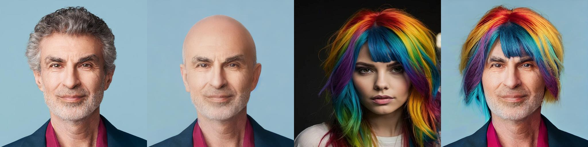
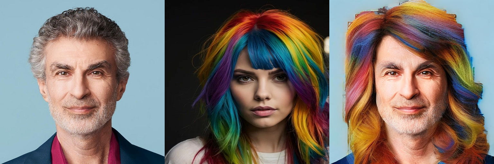
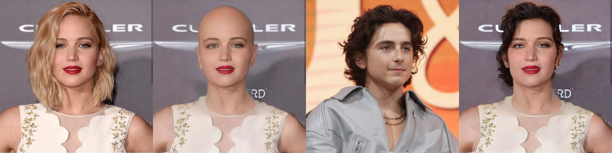
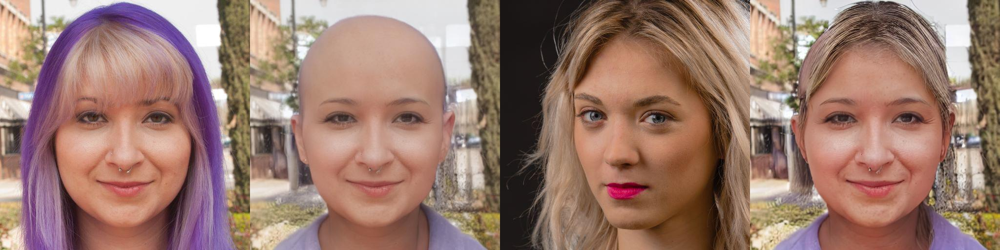
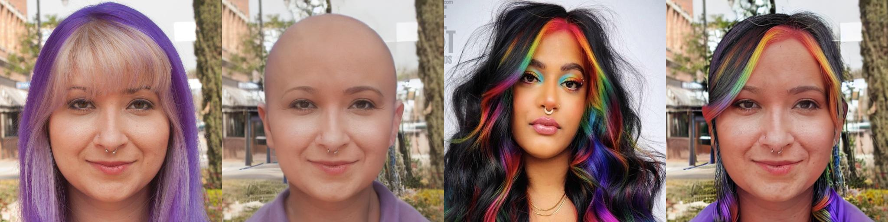
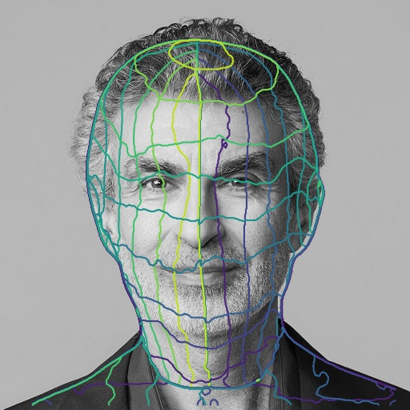
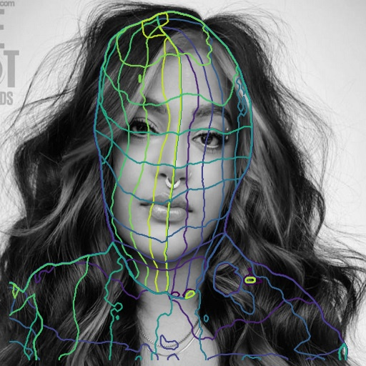
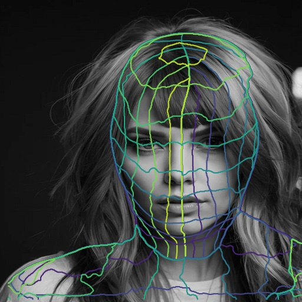

## 입력 이미지(VividHairStyler dataset)

  
  

Stable-Hair 입력 이미지 size : 512*512(jpg 파일) - png 파일 시 오류
VividHairStyler 입력 이미지 size : 1024*1024(png 파일)- 다른 사이즈일 시 오류

### Stable-Hair 결과 이미지(Bald/Transfer)

  
  

- Bald 변환
    - 실행 시간 : 17:20
- Hair Transfer
    - 실행 시간 : 48:44

### Stable-Hair 결과 이미지(Bald/Transfer)

  
  

### VividHairStyler 결과 이미지(Bald / Transfer)

  
  

실행 시간 5분 내외

### HairFusion 결과 이미지(Bald / Transfer)

  
  

### STABLE_HAIR

### HAIR_FUSION

### STABLE_HAIR

### HAIR_FUSION

### STABLE_HAIR

###  HAIR_FUSION

우선 Stable-Hair 모음ZIP

### 문제 현상 요약(STABLE_HAIR)
1. 색상 전이(color transfer)는 매우 정확함(염색, 하이라이트, 톤 변화 모두 반영됨)
2. 그러나 머리길이와 모양은 거의 변하지 않고 원본 두상에 맞추어 짧은 머리로 제한 되는 경향이 있음

과연 원본 두상이 영향을 주는 것일까?
원본 이미지에 긴 머리의 여성을 입력해보자

살짝 애매. 더 돌려보자

영향은 조금 있는 듯? 
(1) Bald Converter 기반의 기준화된 두상 문제.
논문에서는 1단계로 모든 입력 이미지를 완전히 대머리 상태로 변환해 표준화.
이는 identity consistency(얼굴 동일성)유지에는 유리하지만, 머리 길이 정보가 손실
모델 입장에서는 얼마나 긴 머리를 어디까지 생성할 지에 대한 기하학적 기준이 사라짐.
=> 주어진 얼굴 윤곽에 너무 강하게 맞추어 머리가 짧아질 수도?

얼굴 크기가 작은 걸 입력으로 넣는다면?

(2) Latent Control Net 구조의 한계
이 구조는 색상 일관성을 유지하기 위하여 latent 공간에서만 수항
덕분에, 색상 전이는 그 어떤 모델보다 우수함
하지만, latent space는 고주파 geometry 정보를 약화시킬 수 있음
따라서 ControlNet이 형상 정보를 충분히 반영하지 못하고, 조금 이상한 머리 모양이 비슷한 결과가 나옴

(3) Hair Extractor의 표현
Hair extractor는 referene 이미지를 U-Net self-attention에 cross-attention으로 삽입해 머리 속성을 주입한다. 덕분에 색상.덱스터에는 강함

### HAIR_FUSION 모음ZIP

문제 사항 요약
1. 머리 끊김 현상

논문 중...
HairFusion highly depends on the performance of external parsing models;
a single strand of bangs may not be captured due to mask failure (Fig.10).

마스크 경계가 조금이라도 어긋나면 -> feature map 경계가 물리적으로 단절

2. 색상 전이는 Stable-Hair가 훨씬 나음. 중간중간 색이 다른 것도 있고. 색이 조금 연해지는 현상 발생. 이것이 latent 공간 + Hair Extractor의 역할..(시간 좀 오래걸리긴 하심)

3. hair mask가 DensePose + Parsing으로 나타남. 

  
  
  

이게 무슨 영향이 있을까... 더 찾아보기