## 입력 이미지(VividHairStyler dataset)

  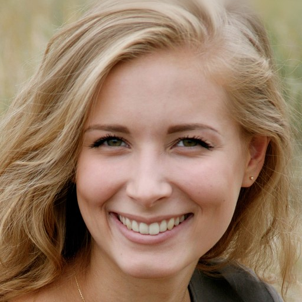
  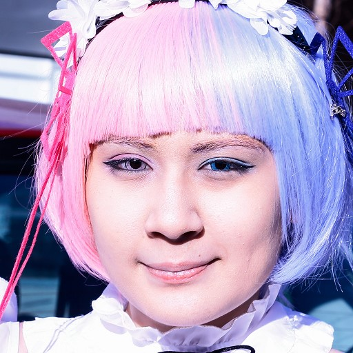

Stable-Hair 입력 이미지 size : 512*512(jpg 파일) - png 파일 시 오류
VividHairStyler 입력 이미지 size : 1024*1024(png 파일)- 다른 사이즈일 시 오류

### Stable-Hair 결과 이미지(Bald/Transfer)

  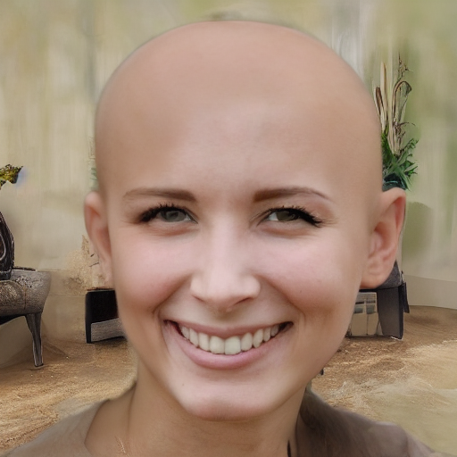
  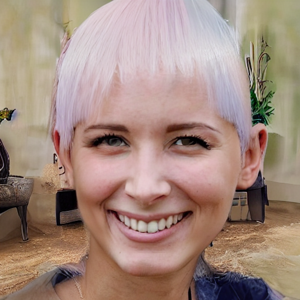

- Bald 변환
    - 실행 시간 : 17:20
- Hair Transfer
    - 실행 시간 : 48:44

### VividHairStyler 결과 이미지(Bald / Transfer)

  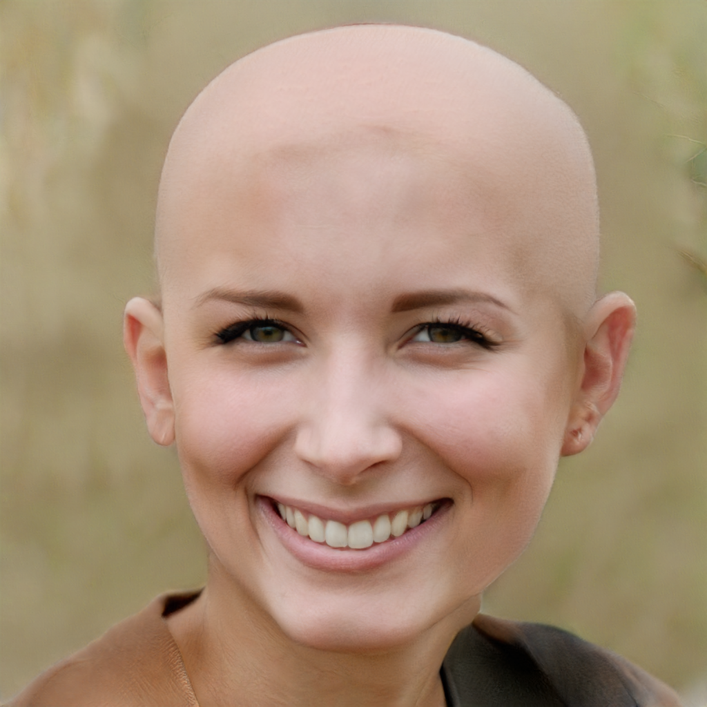
  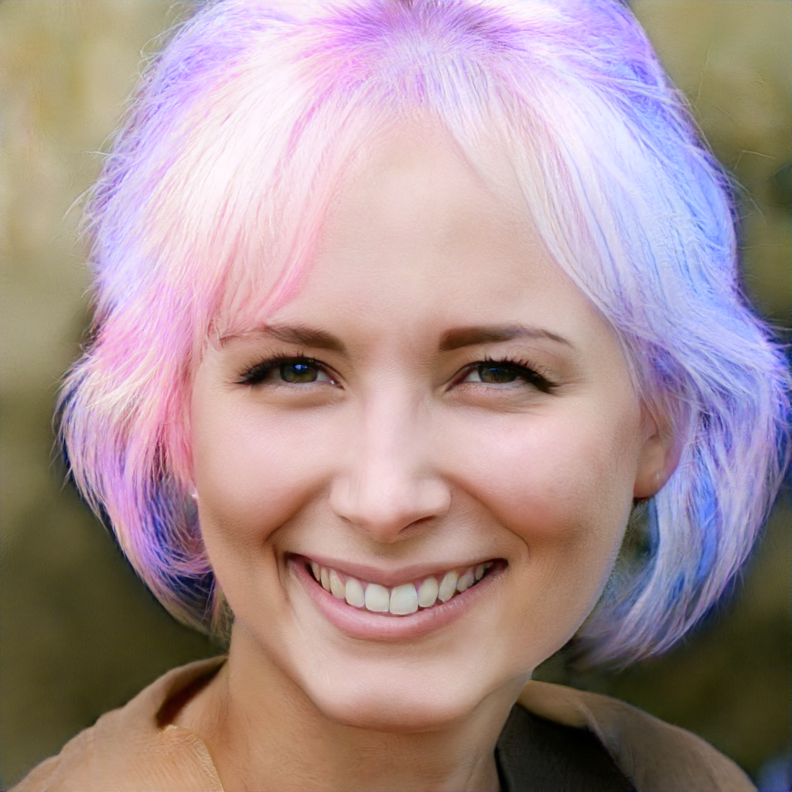

실행 시간 5분 내외

### HairFusion 결과 이미지(Bald / Transfer)

  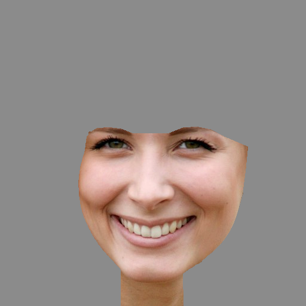
  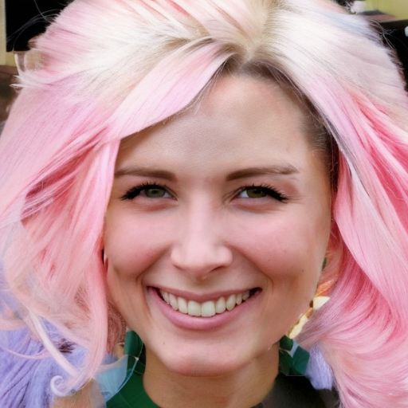

### STABLE_HAIR
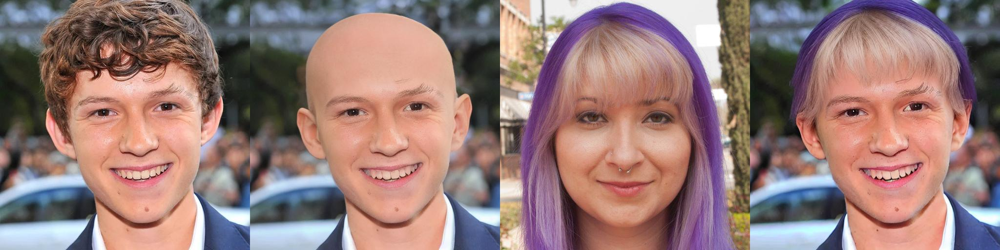

### HAIR_FUSION
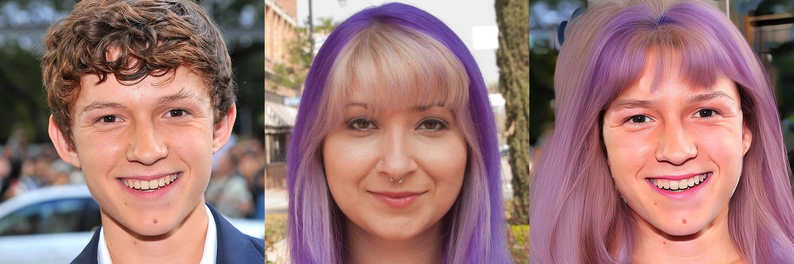

### STABLE_HAIR
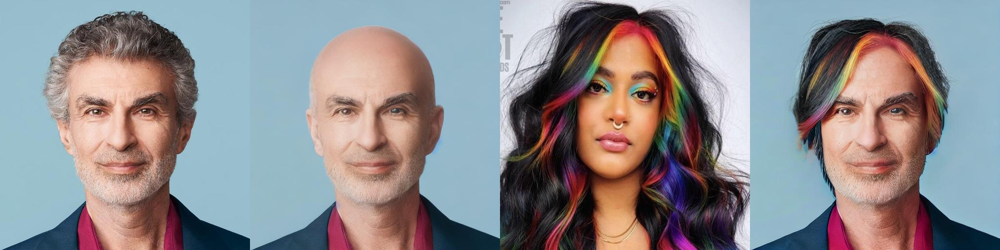

### HAIR_FUSION
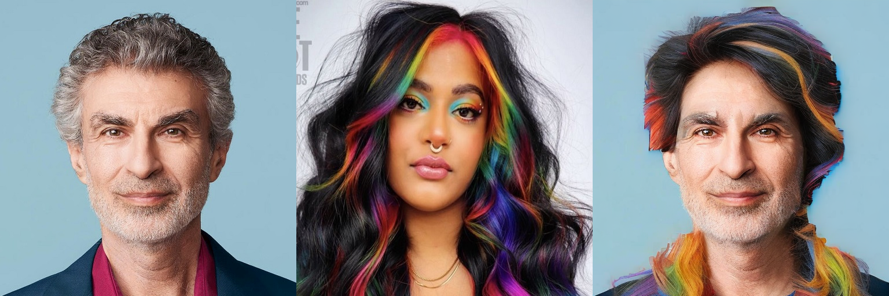

