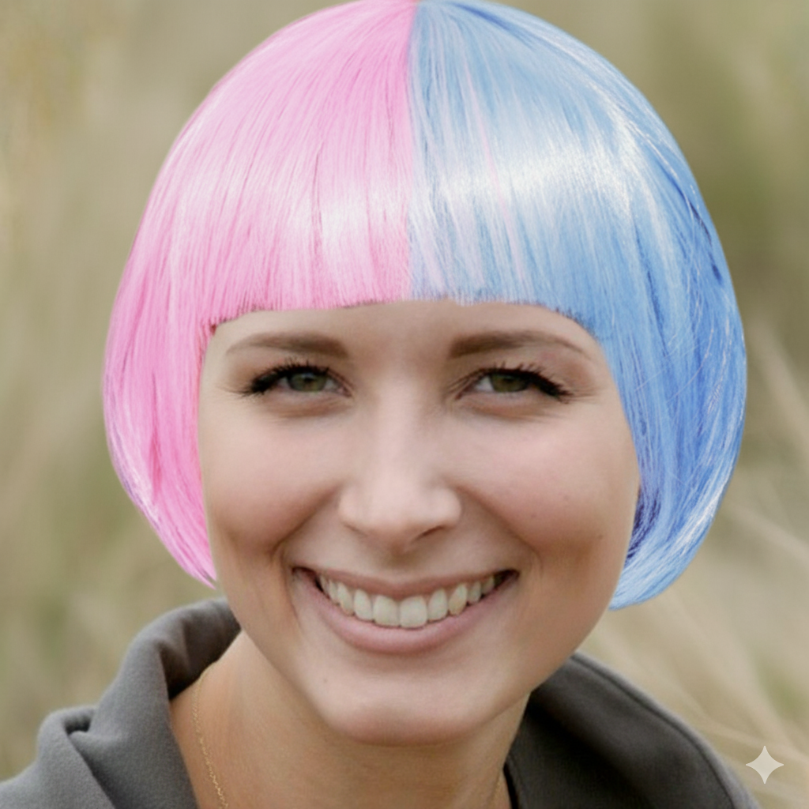
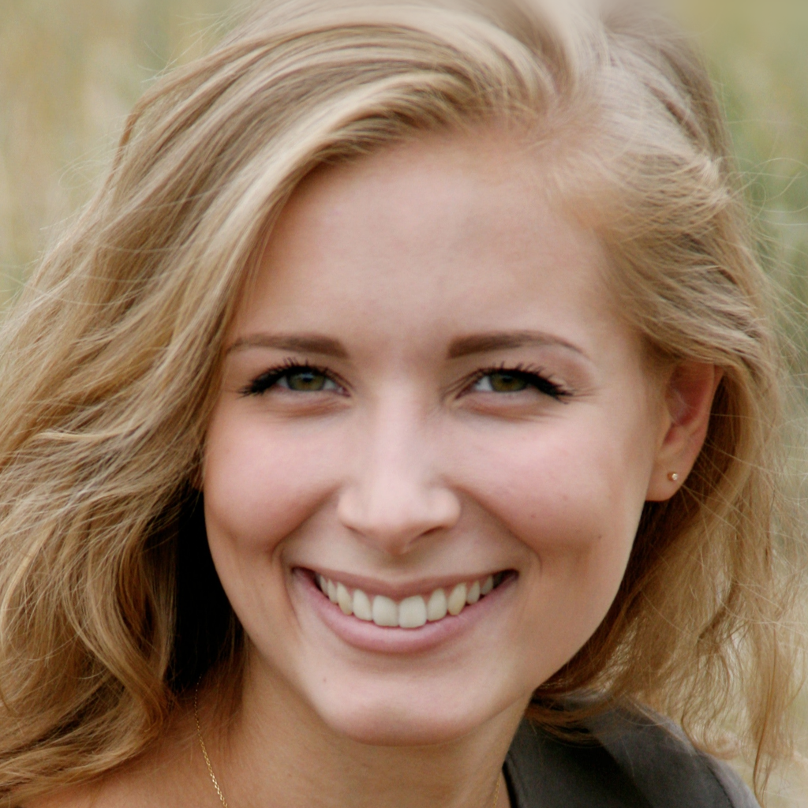
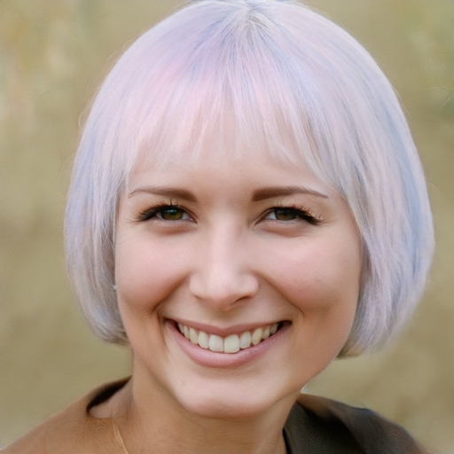
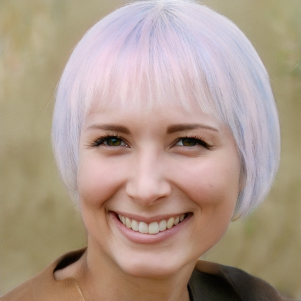
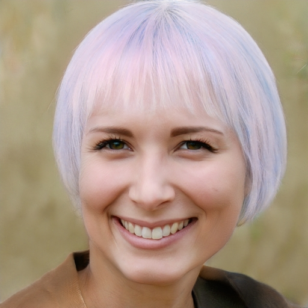

### 나노 바나나로 만든 이미지

이 이미지를 VividHairStyler 내에서 Structure image 와 Appearamce image 에 삽입

  
  
  

결과

참조 색이 더 선명하게 반영되었으면 좋겠다는 생각이 들어서 style_loss의 가중치를 변경해보자는 생각이 듬
입력마다 최적 가중치가 다를 것이라 생각이 들어서 UI에서 실시간으로 조절할 수 있는 style_loss 슬라이드 형식 추가
(min 5000, max 20000 코드 기본값은 10000 이였음)

결과

  
  
  

 
