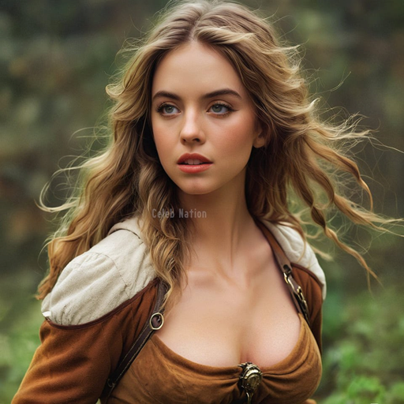
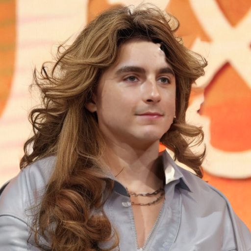
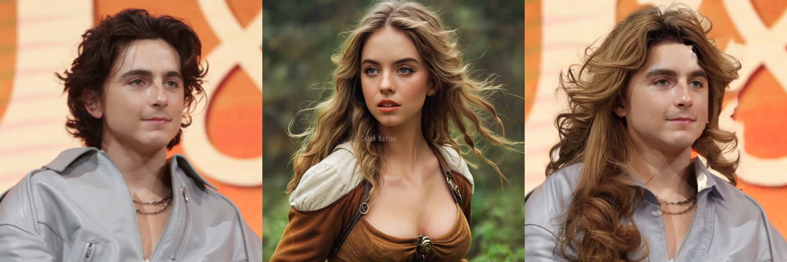
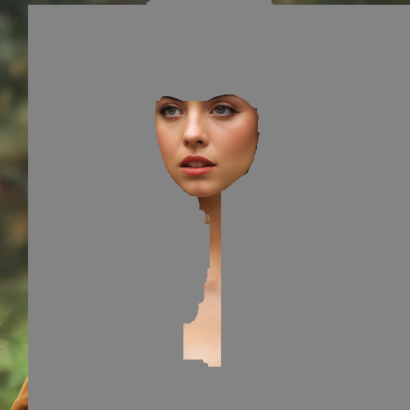
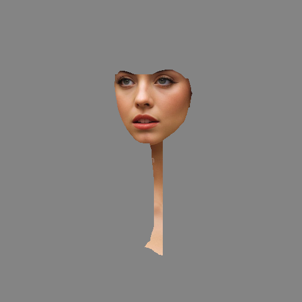
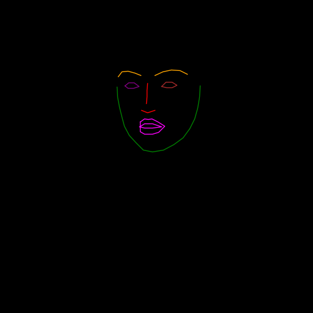
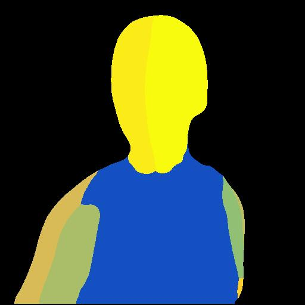
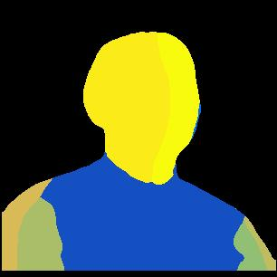
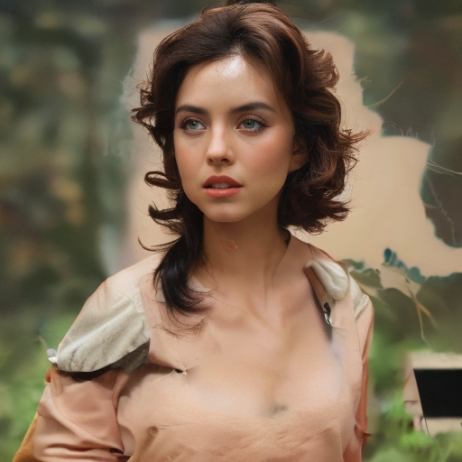
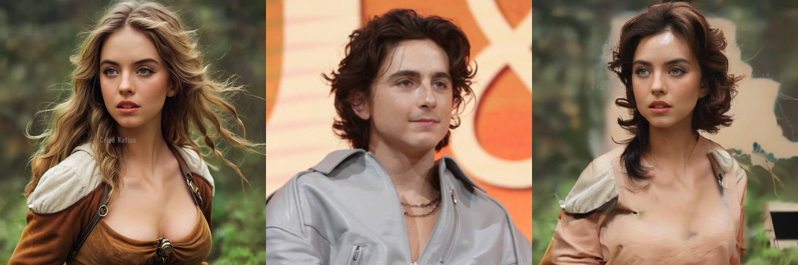

# Hair-Fusion 동작

### 환경 어떻게 맞추었는지..
뭔가 이슈가 많았다. 그 중 가장 큰 이슈는 CUDA 드라이버와 PyTorch 빌드 버전의 불일치였다
"The detected CUDA version (12.6) mismatches PyTorch (11.7)” 경고/오류가 끊임없이 나왔다.
그러니까 호스트 드라이버는 12.6인데 설치한 Torch는 cu117로 빌드됨

맞춘 환경 정리
python        : 3.10.9
torch         : 2.0.0+cu117
torch.version.cuda : 11.7
cuda.is_available : True
device[0]     : NVIDIA GeForce RTX 4070 SUPER
torchvision   : 0.15.1+cu117
cudnn.version : 8500

Python이 불러오는 CUDA 런타임이 항상 11.7이 우선 -> 드라이버 12.6 와의 불일치 경고가 사라짐

### 입력 이미지(source/ref)
입력 이미지는 512*512 png 형식이어야 함.

  
  

### Hair-Agnostic

  
  
  

### Result

### 입력 이미지(source/ref)

  
  

### Hair-Agnostic

  
  
  

### Preprocess

  

CUDA_VISIBLE_DEVICES=0 python preprocess.py --img_path ${image_path} --save_dir_name ${dir_name} --crop_scale ${crop_scale} 

crop_scale deafult 값은 4임.
참고로 너무 작게 crop 하면 얼굴 인식이 안되어서 에러 뜸
얼마나 crop 하느냐에 따라서도 결과 달라질듯. HairFusion은 이미지에서 얼굴이 차지하는 비율이 높을 수록 성능이 좋아지는 느낌? 이것도 실험 해볼것.

  
  
  

### Pose Encoder

  
  

Densepose 돌릴 때 전용 Docker 이미지를 만들어서 사용함. 
추가로 내 환경에 맞춘 requirements.txt 를 만들어서 환경을 비교적 쉽게(?) 맞춤

requirements.txt
docutils==0.16
https://github.com/sphinx-doc/sphinx/commit/7acd3ada3f38076af7b2b5c9f3b60bb9c2587a3d
sphinx==3.2.0
recommonmark==0.6.0
sphinx_rtd_theme
Dependencies here are only those required by import
termcolor
numpy
tqdm
matplotlib
termcolor
yacs
tabulate
cloudpickle
Pillow
future
git+https://github.com/facebookresearch/fvcore.git
https://download.pytorch.org/whl/cpu/torch-1.8.1%2Bcpu-cp37-cp37m-linux_x86_64.whl
https://download.pytorch.org/whl/cpu/torchvision-0.9.1%2Bcpu-cp37-cp37m-linux_x86_64.whl
omegaconf>=2.1.0.dev24
hydra-core>=1.1.0.dev5
scipy
timm

### Result

