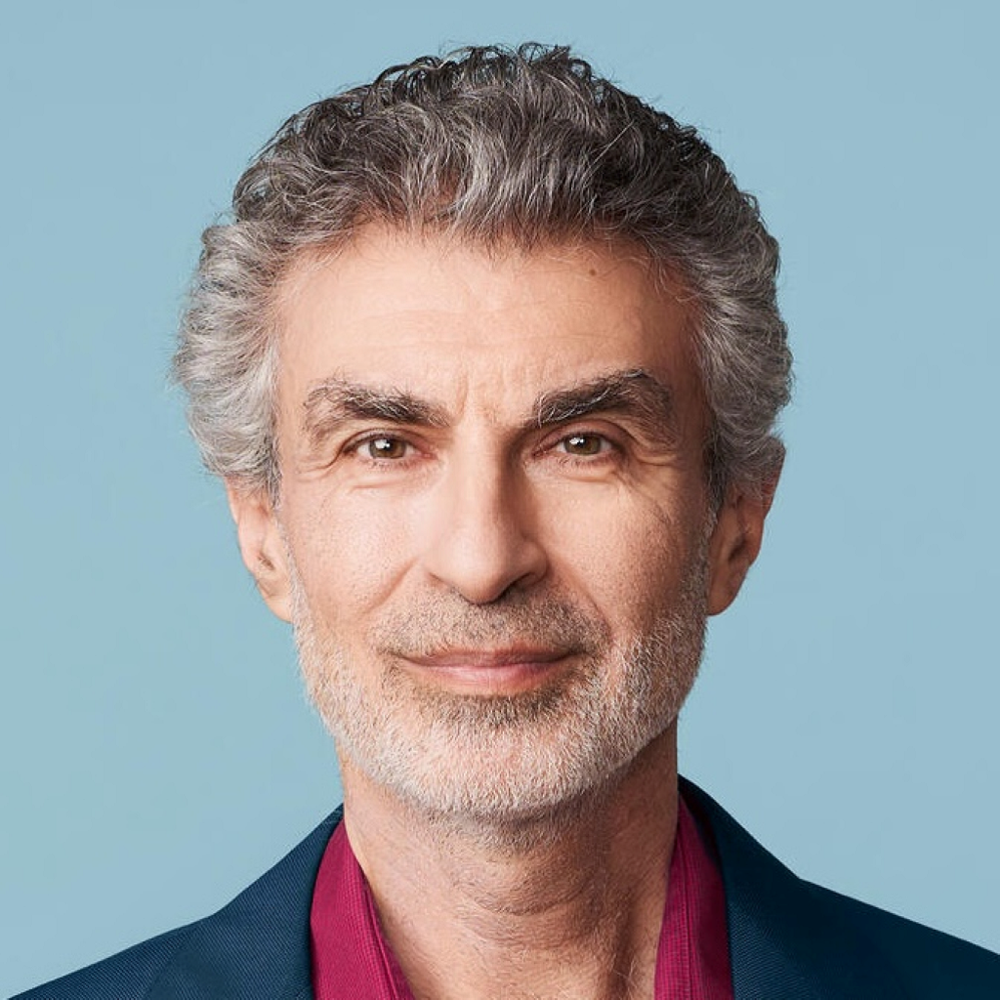
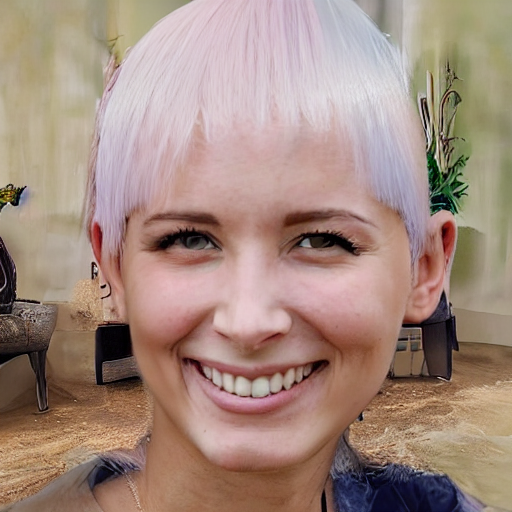

# Stable Hair / VividHairStyler 비교

## 입력 이미지(Stable Hair dataset)

  
  

Stable-Hair 입력 이미지 size : 512*512(jpg 파일) - png 파일 시 오류
VividHairStyler 입력 이미지 size : 1024*1024(png 파일) - 다른 사이즈일 시 오류

VividHairStyler의 경우, 입력 이미지가 3개가 필요함(source, shape_ref, color_ref)
Stable-Hair와 결과 비교를 위하여, shape_ref과 color_ref는 동일한 이미지로 구성

### Stable-Hair 결과 이미지(Bald/Transfer)

  
  

Stable-Hair는 2step 으로 구성되어 있음.
- Bald 변환
    - 원본 얼굴에서 머리 제거
    - 사용 모델 : bald_converter_path
    - 실행 시간 : 14: 21
- Hair Transfer
    - 참조 이미지 머리카락을 원본에 이식
    - 사용 모델 : utils.pipeline_cn.StableDiffusionControlNetPipeline(SD 기반) + ControlNet + ref_unet + hair_encoder + adapter
    - 실행 시간 : 44:15

### VividHairStyler 결과 이미지(Bald / Transfer)

  
  

- Bald 변환
    - 모델 : LevelMapper(HairMapper 기반) -> W+를 대머리 잠재로 변환
    - 생성기 : StyleGAN2 FFHQ 1024(Generator)
- Hair Transfer
    - 모델 : e4e Encoder

실행 시간은 5분 내외.

## 입력 이미지(VividHairStyler dataset)

  
  

Stable-Hair 입력 이미지 size : 512*512(jpg 파일) - png 파일 시 오류
VividHairStyler 입력 이미지 size : 1024*1024(png 파일)- 다른 사이즈일 시 오류

### Stable-Hair 결과 이미지(Bald/Transfer)

  
  

- Bald 변환
    - 실행 시간 : 17:20
- Hair Transfer
    - 실행 시간 : 48:44

### VividHairStyler 결과 이미지(Bald / Transfer)

  
  

실행 시간 5분 내외
