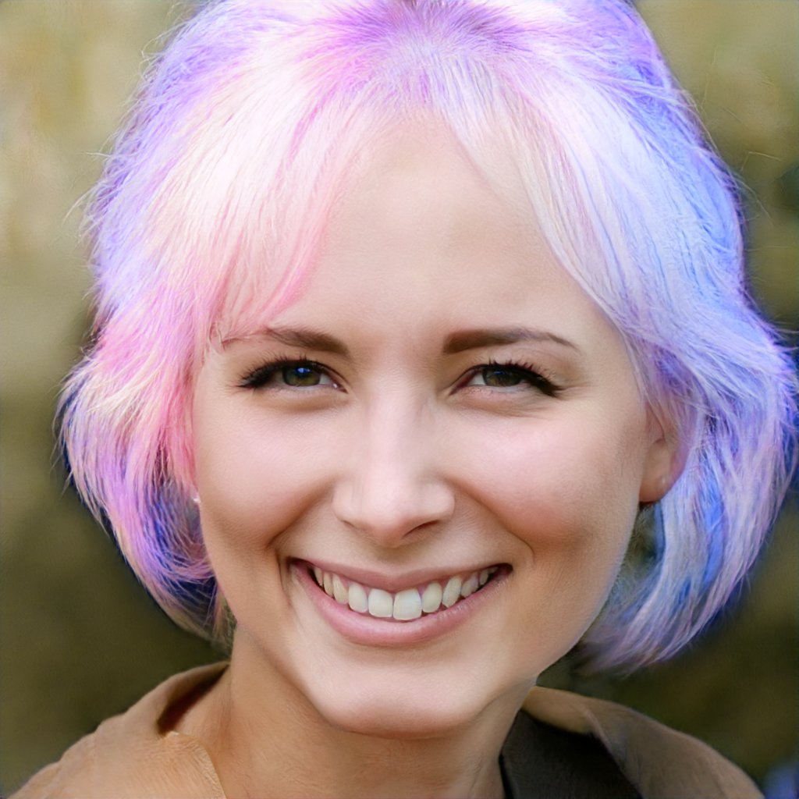

# Stable Hair / VividHairStyler 비교

## 입력 이미지(Stable Hair dataset)

  
  

### Stable-Hair 결과 이미지(Bald/Transfer)

  
  

### VividHairStyler 결과 이미지(Bald / Transfer)

  
  

## 입력 이미지(VividHairStyler dataset)

  
  

### Stable-Hair 결과 이미지(Bald/Transfer)

  
  

### VividHairStyler 결과 이미지(Bald / Transfer)

  
  

