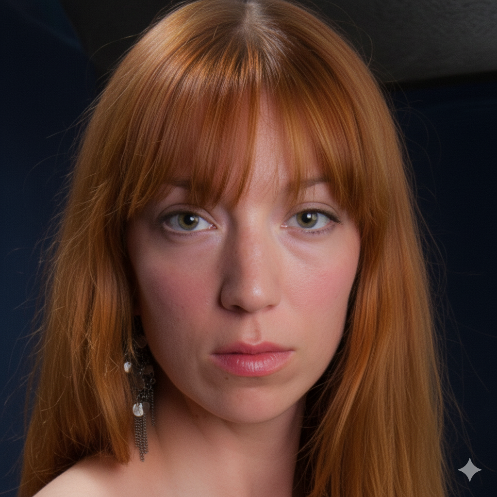
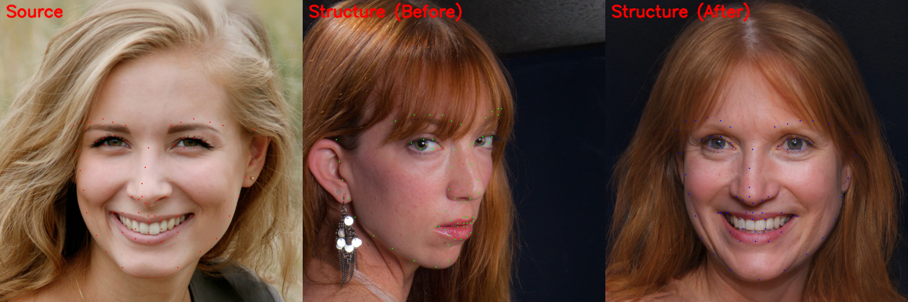
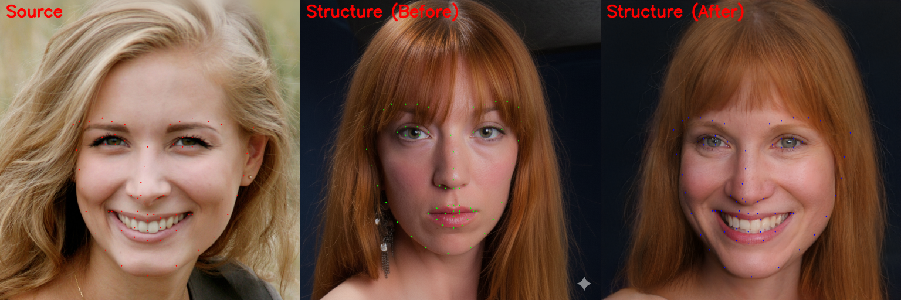
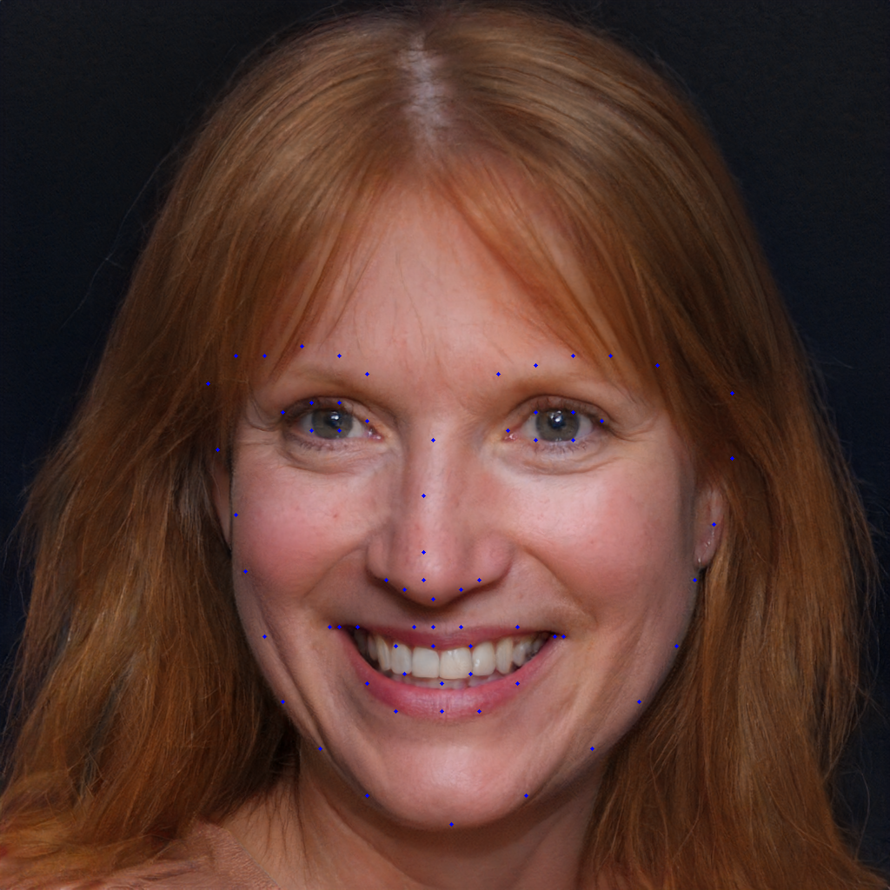
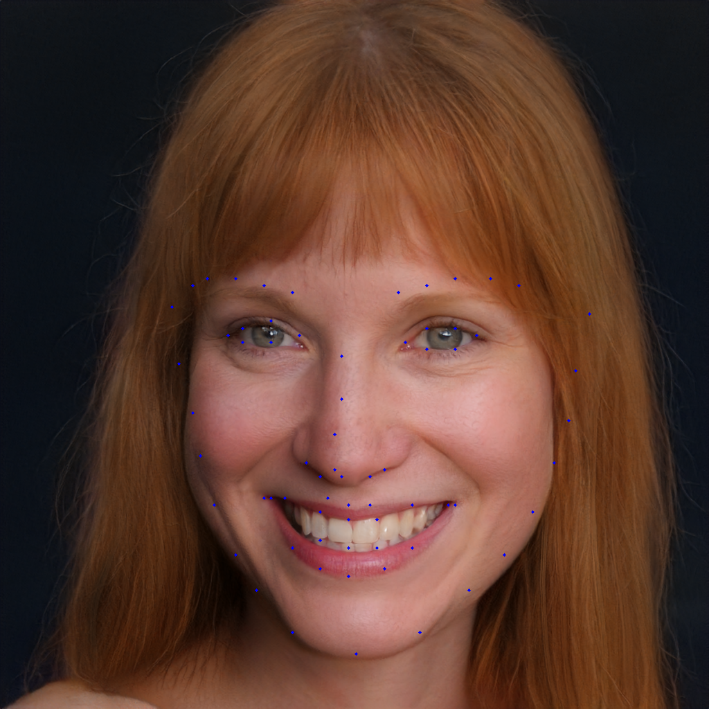

  
  
  
  

  
  
  
  

  
  
  
  

##### Nano banana 입력 프롬프트

> 첫 번째 이미지(source 이미지)의 얼굴 각도와 포즈를 두 번째 이미지(ref 이미지)에 적용하여, 두 번째 이미지의 인물이 첫 번째 이미지의 인물처럼 왼쪽 측면을 바라보고 카메라를 응시하는 포즈를 취하도록 변경해줘. 두 번째 이미지 인물의 원래 얼굴 특징과 표정은 최대한 유지하면서 각도만 자연스럽게 조정해줘.

##### 결과

  
  

##### 이렇게 출력된 결과를 다시 gan-inversion으로

  
  
  
  

##### 결과 비교

  
  

##### 이번엔 얼굴 반대방향 케이스.

  
  
  
  

  
  
  
  

##### 결과 비교

  
  

##### 극단적인 case

  
  
  
  

##### solution

  
  
  
  

##### 결과 비교

  
  

##### 반대

  
  
  
  

##### solution

  
  
  
  

##### 결과 비교

  
  

### Source 이미지는 정면 바라보는 이미지로 하고, Structure 이미지를 Source 이미지와 pose 가 다른 것을 적용하고 pose-alignment 할 때 face-landmark 추출하여 중간 결과물을 확인해보기'

#### Pose-Alignment 모델 구조 및 동작 원리

##### 1. 사용 모델
- 모델명 : Adrian Bulat의 face-alignment(FAN)
- 역할 : 얼굴의 68개 랜드마크 추출 -> 정렬 및 워핑에 사용

##### 2. 동작 방식 요약
- FaceAlignment() 객체 생성 시 api.py 내부에서 load_file_from_url() 호출
- Pytorch 버전에 맞는 URL에서 FAN/S3FD 가중치 자동 다운로드
- 다운로드 완료 후 캐시(~/.cache/torch/hub/checkpoints)에 저장
- 이후 실행부터는 캐시에서 즉시 로드

  
  

위의 이미지는 FFHQ 데이터셋, 아래의 이미지는 나노 바나나를 통해 옆의 이미지를 정면을 보게 생성한 이미지. 이 두 사진을 input으로 넣어서 pose-alignment 에 있어서 기존 처음 각도의 차이가 얼마나 영향이 있는 지 알아볼 것이다. 

우선 기본 사진. source 이미지에 비하면 포즈가 많이 다른 편
> source img / structure img/ Appearance img / result

  
  
  
  

> 이때 pose-alignment가 진행되었을 때, 중간 결과물 출력
##### pose-alignment 진행 후 랜드마크 변화 사진

  

> source img / structure img/ Appearance img / result

  
  
  
  

> 이때 pose-alignment가 진행되었을 때, 중간 결과물 출력
##### pose-alignment 진행 후 랜드마크 변화 사진

  

>> 비교해볼까?
##### pose-alignment 진행 전 / 진행 후 landmark 의 변화

  
  
  
  

##### structure 이미지가 source image와 얼마나 포즈가 유사하느냐가 결과가 미치는 영향분석
##### 포즈가 다른 경우------------------------------------------------------------------------------------------------   포즈가 비슷한 경우(nano banana로 이미지 생성)

  
  
  
  

pose-alignment에 따라 결과가 달라지는 것을 확인할 수 있다. 

